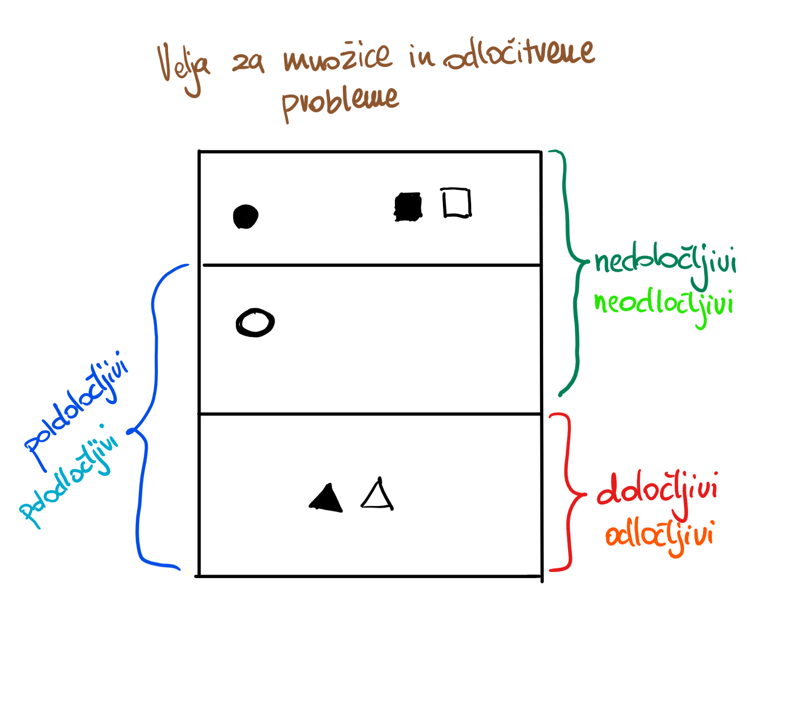
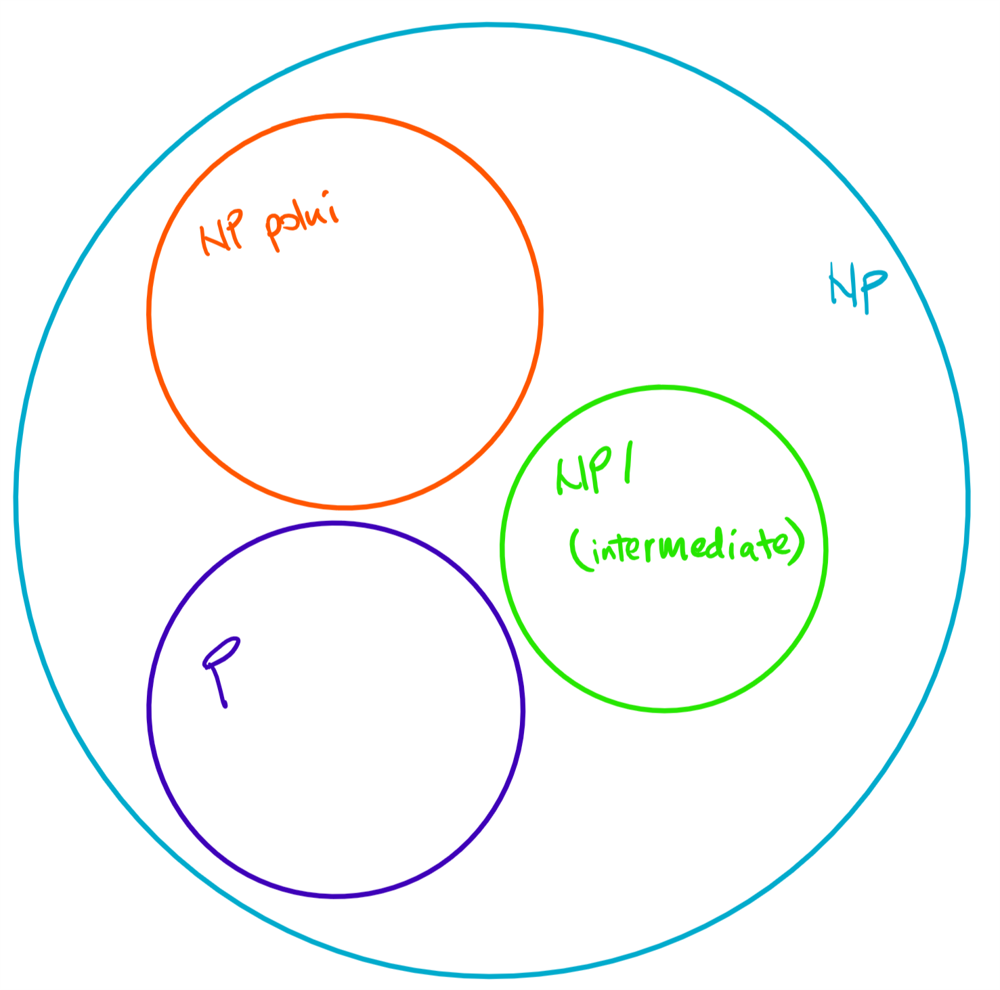

# Izračunljivost in računska zahtevnost
### Študijsko leto 2018/19
### prof. dr. Borut Robič

- [Izračunljivost in računska zahtevnost](#izra%c4%8dunljivost-in-ra%c4%8dunska-zahtevnost)
    - [Študijsko leto 2018/19](#%c5%a0tudijsko-leto-201819)
    - [prof. dr. Borut Robič](#prof-dr-borut-robi%c4%8d)
- [1. Uvod](#1-uvod)
    - [String (beseda)](#string-beseda)
    - [Abeceda](#abeceda)
    - [Jezik](#jezik)
    - [Grafi in drevesa](#grafi-in-drevesa)
  - [Notacija množic](#notacija-mno%c5%beic)
    - [Osnovne operacije nad množicami:](#osnovne-operacije-nad-mno%c5%beicami)
    - [Relacije med množicami](#relacije-med-mno%c5%beicami)
      - [P-zaprta množica](#p-zaprta-mno%c5%beica)
  - [Računski model](#ra%c4%8dunski-model)
    - [Neizračunljivi problemi](#neizra%c4%8dunljivi-problemi)
- [2. Končni avtomati in regularni izrazi](#2-kon%c4%8dni-avtomati-in-regularni-izrazi)
  - [Sistem končni stanj](#sistem-kon%c4%8dni-stanj)
  - [Deterministični končni avtomat $DKA = (Q, \Sigma, \delta, q_0, F)$](#deterministi%c4%8dni-kon%c4%8dni-avtomat-dka--q-sigma-delta-q0-f)
    - [Definicija DKA](#definicija-dka)
    - [Delovanje DKA](#delovanje-dka)
  - [Nedeterministični končni avtomat $NKA = (Q, \Sigma, \delta, q_0, F)$](#nedeterministi%c4%8dni-kon%c4%8dni-avtomat-nka--q-sigma-delta-q0-f)
    - [Definicija](#definicija)
  - [Ekvivalentnost DKA in NKA](#ekvivalentnost-dka-in-nka)
  - [Nedeterministični končni avtomati s tihimi prehodi $\varepsilon$](#nedeterministi%c4%8dni-kon%c4%8dni-avtomati-s-tihimi-prehodi-varepsilon)
    - [Definicija](#definicija-1)
  - [Ekvivalentnost NKA in NKA$_\varepsilon$](#ekvivalentnost-nka-in-nkavarepsilon)
  - [Regularni izrazi](#regularni-izrazi)
    - [Definicija regularnih izrazov](#definicija-regularnih-izrazov)
    - [Operacije nad regularnimi izrazi](#operacije-nad-regularnimi-izrazi)
      - [Združevanje regularnih izrazov](#zdru%c5%beevanje-regularnih-izrazov)
      - [Klenovo in pozitivno zaprtje](#klenovo-in-pozitivno-zaprtje)
    - [Ekvivalenca med končnimi avtomati in regularnimi izrazi](#ekvivalenca-med-kon%c4%8dnimi-avtomati-in-regularnimi-izrazi)
- [3. Regularne množice](#3-regularne-mno%c5%beice)
  - [Lema o napihovanju](#lema-o-napihovanju)
  - [Lastnosti regularnih množic](#lastnosti-regularnih-mno%c5%beic)
  - [Odločitveni algoritmi za regularne množice](#odlo%c4%8ditveni-algoritmi-za-regularne-mno%c5%beice)
    - [Praznost in neskončnost regularnih množic](#praznost-in-neskon%c4%8dnost-regularnih-mno%c5%beic)
    - [Ekvivalentnost končnih avtomatov](#ekvivalentnost-kon%c4%8dnih-avtomatov)
  - [Myhill-Nerode teorem](#myhill-nerode-teorem)
    - [Definicija Myhill-Nerode teorema](#definicija-myhill-nerode-teorema)
- [4. Kontektsno neodvisne gramatike](#4-kontektsno-neodvisne-gramatike)
  - [Definicija KNG](#definicija-kng)
  - [Definicija jezikov generiranih s KNG](#definicija-jezikov-generiranih-s-kng)
  - [Derivacijsko drevo](#derivacijsko-drevo)
    - [Najbolj leva in najbolj desna derivacija](#najbolj-leva-in-najbolj-desna-derivacija)
  - [Dvoumnne gramatike](#dvoumnne-gramatike)
  - [Poenostavljanje kontekstno neodvisnih gramatik](#poenostavljanje-kontekstno-neodvisnih-gramatik)
    - [Eliminacija neuporabnih simbolov](#eliminacija-neuporabnih-simbolov)
    - [Eliminacija $\varepsilon$ produkcije](#eliminacija-varepsilon-produkcije)
    - [Eliminacija enotskih produkcij](#eliminacija-enotskih-produkcij)
  - [Normalna oblika Chomskega](#normalna-oblika-chomskega)
  - [Normalna oblika Greibachove](#normalna-oblika-greibachove)
- [Skladovni avtomati](#skladovni-avtomati)
    - [Sestavni deli skladovnega avtomata](#sestavni-deli-skladovnega-avtomata)
    - [Premiki skladovnega avtomata](#premiki-skladovnega-avtomata)
  - [Definicija skladovnega avtomata](#definicija-skladovnega-avtomata)
  - [Skladovni avtomati in kontekstno neodvisni jeziki](#skladovni-avtomati-in-kontekstno-neodvisni-jeziki)
    - [Ekvivalentnost SA, ki sprejme končno stanje in prazen sklad](#ekvivalentnost-sa-ki-sprejme-kon%c4%8dno-stanje-in-prazen-sklad)
    - [Ekvivalenca SA in KNJ](#ekvivalenca-sa-in-knj)
    - [Moč determinističnih in nedeterminističnih SA](#mo%c4%8d-deterministi%c4%8dnih-in-nedeterministi%c4%8dnih-sa)
- [5. Lastnosti kontekstno nedovisnih jezikov](#5-lastnosti-kontekstno-nedovisnih-jezikov)
  - [Lema o napihovanju za kontekstno neodvisne jezike](#lema-o-napihovanju-za-kontekstno-neodvisne-jezike)
  - [Lastnosti zaprte nad KNJ](#lastnosti-zaprte-nad-knj)
  - [Odločitveni algoritmi za KNJ](#odlo%c4%8ditveni-algoritmi-za-knj)
- [7. Turingovi stroji](#7-turingovi-stroji)
  - [Definicija Turingovega stroja](#definicija-turingovega-stroja)
  - [Uporaba Turingovega stroja](#uporaba-turingovega-stroja)
    - [Računanje vrednosti s TS](#ra%c4%8dunanje-vrednosti-s-ts)
      - [Kapaciteta TS](#kapaciteta-ts)
    - [Razpoznavanje množic s TS](#razpoznavanje-mno%c5%beic-s-ts)
      - [Zmožnost TS](#zmo%c5%benost-ts)
    - [Generiranje množic](#generiranje-mno%c5%beic)
    - [Izračunljivo preštevni jeziki](#izra%c4%8dunljivo-pre%c5%a1tevni-jeziki)
    - [Odnosi med razredi jezikov](#odnosi-med-razredi-jezikov)
  - [Modifikacije Turingovih strojev](#modifikacije-turingovih-strojev)
    - [Turingov stroj s končnim pomnilnikom](#turingov-stroj-s-kon%c4%8dnim-pomnilnikom)
    - [Turingov stroj z multitračnim trakom](#turingov-stroj-z-multitra%c4%8dnim-trakom)
    - [Turingov stroj z dvostranskim neskončnim trakom](#turingov-stroj-z-dvostranskim-neskon%c4%8dnim-trakom)
    - [Turingov stroj z več trakovi](#turingov-stroj-z-ve%c4%8d-trakovi)
    - [Turingov stroj z multidimenzionalnim trakom](#turingov-stroj-z-multidimenzionalnim-trakom)
    - [Turingovi stroji z nedeterminističnim programom](#turingovi-stroji-z-nedeterministi%c4%8dnim-programom)
  - [Univerzalen Turingov stroj](#univerzalen-turingov-stroj)
    - [Kodiranje Turingovega stroja TODO](#kodiranje-turingovega-stroja-todo)
    - [Obstoj univerzalnega Turingovega stroja](#obstoj-univerzalnega-turingovega-stroja)
      - [Posledice obstoja univerzalnega TS](#posledice-obstoja-univerzalnega-ts)
- [8. Nedoločljivost](#8-nedolo%c4%8dljivost)
  - [Vrste računskih problemov](#vrste-ra%c4%8dunskih-problemov)
  - [Reševanje odločitvenih problemov](#re%c5%a1evanje-odlo%c4%8ditvenih-problemov)
    - [Jezik odločitvenih problemov](#jezik-odlo%c4%8ditvenih-problemov)
  - [Problem ustavitve](#problem-ustavitve)
    - [Dokaz o nedoločljivosti](#dokaz-o-nedolo%c4%8dljivosti)
  - [Osnovne vrste odločitveni problemov](#osnovne-vrste-odlo%c4%8ditveni-problemov)
    - [Komplementarne množice in odločitveni problemi](#komplementarne-mno%c5%beice-in-odlo%c4%8ditveni-problemi)
  - [Primeri neiračunljivih problemov](#primeri-neira%c4%8dunljivih-problemov)
- [10. Teorija računske zahtevnosti](#10-teorija-ra%c4%8dunske-zahtevnosti)
  - [Deterministični čas in prostor ($DTIME, DSPACE$)](#deterministi%c4%8dni-%c4%8das-in-prostor-dtime-dspace)
    - [Deterministična časovna zahtevnost & zahtevnostni razred *DTIME*](#deterministi%c4%8dna-%c4%8dasovna-zahtevnost--zahtevnostni-razred-dtime)
    - [Deterministična prostorska zahtevnost & zahtevnostni razred _DSPACE_](#deterministi%c4%8dna-prostorska-zahtevnost--zahtevnostni-razred-dspace)
  - [Nedeterministični čas in prostor *(NTIME, NSPACE)*](#nedeterministi%c4%8dni-%c4%8das-in-prostor-ntime-nspace)
    - [Nedeterministična časovna zahtevnost & zahtevnostni razred *NTIME*](#nedeterministi%c4%8dna-%c4%8dasovna-zahtevnost--zahtevnostni-razred-ntime)
    - [Nedeterministična prostorska zahtevnost & zahtevnostni razred _NSPACE_](#nedeterministi%c4%8dna-prostorska-zahtevnost--zahtevnostni-razred-nspace)
    - [Povzetek zahtevnostnih razredov](#povzetek-zahtevnostnih-razredov)
  - [Kompresija traku, linearna pohitritev, redukcija števila trakov](#kompresija-traku-linearna-pohitritev-redukcija-%c5%a1tevila-trakov)
    - [Kompresija traku, linearna pohitritev](#kompresija-traku-linearna-pohitritev)
    - [Redukcija števila trakov](#redukcija-%c5%a1tevila-trakov)
  - [Relacije med *DTIME, DSPACE, NTIME, NSPACE*](#relacije-med-dtime-dspace-ntime-nspace)
    - [Funkcija, ki se lepo obnaša *(well-behaved)*](#funkcija-ki-se-lepo-obna%c5%a1a-well-behaved)
  - [Razredi *P, NP, PSPACE, NPSPACE*](#razredi-p-np-pspace-npspace)
    - [Osnovna relacija med razredi](#osnovna-relacija-med-razredi)
  - [$P =^? NP$](#p--np)
  - [_NP-polni_ in _NP-težki_ problemi](#np-polni-in-np-te%c5%beki-problemi)
    - [Povzetek](#povzetek)

# 1. Uvod
### String (beseda)
niz znakov z določenim vrstnim redom\
*    $|w|$ - dolžina niza $w$
*    $\varepsilon$ - prazen niz
     *    dolžina praznega niza je 0 ( $|\varepsilon| = 0$ )
*   __predpona__ je kakršna koli dolžina znakov, ki se pojavijo na začetku niza
*   __pripona__ je kakršna koli dolžina znakov, ki se pojavijo na repu niza
    *   _prava pripona/predpona_ je katerakoli pripona ali predpona, ki ni enaka celotnemu nizu
*   _združevanje nizov_ - $prviNiz + drugiNiz = prviNizdrugiNiz$
    * vedno velja: $w \varepsilon = \varepsilon w = w \quad \forall w$

### Abeceda
> __Abeceda__ je končna množica različnih znakov

### Jezik
> __Formalen jezik__ je množica nizov iz znakov neke abecede. _Prazna množica_, $\emptyset$ in množica, ki vsebuje samo prazen niz, $\{ \ \varepsilon \ \}$, so različni jeziki.
> >Množica vseh nizov abecede $\sum$ je množica $\sum ^*$ \
> >_Primer:_ $\sum = \{a\} \Rightarrow \sum ^* = \{ \varepsilon, a, aa, aaa, aaaa, ... \}$

### Grafi in drevesa
> __Neusmerjen graf__ označujemo z $G = (V, E)$, kjer je $V$ končna množica vozlišč in $E$ končna množica parov vozlišč imenovanih robovi.
>> __Pot v grafu__ je zaporedje vozlišč grafa tako, da obstaja povezava med dvema soležnima vozliščema v poti.

> __Usmerjen graf__ označujemo z $G = (V, A)$, kjer je $V$ končna množica vozlišč in $A$ končna množica urejenih (usmerjenih) parov vozlišč.
> > Urejeno pot med vozliščema $u$ in $v$ označimo kot $u \rightarrow v$

> __Drevo__ je graf z lastnostmi:
> * obstaja natanko eno vozlišče, imenovano _root_ ali _koren_, ki nima predhodnika
> * vsako vozlišče (razen _root_) ima natanko enega predhodnika (starša)
> * otroci vozlišča so urejeni od leve proti desni
> > Predhodnika vozlišča imenujemo _starš_, naslednika imenujemo _sin_, če vozlišče nima nobenega sina se imenuje _list_

## Notacija množic
> _Množica je neurejena kolekcija objektov (članov), ki se ne ponavljajo._

> _Končne množice lahko definiramo tako, da navedemo **vse** člane množice._\
> _Primer končne množice: $\{ a, b, c\}$ je končna množica._

$\{x | P(x) \}$  - $x$ je množica, da velja $P(x)$\
$\{ x \in A | P(x)\}$ - $x$ je množica elementov množice $A$, da velja $P(x)$

* če je vsak element množice $A$ element množice $B$ pišemo: $A \subseteq B$ (velja tudi $B \supseteq A)$
* če velja $A \subseteq B$, vendar ne velja $A = B$, potem rečemo, da je $A$ vsebovan v $B$, pišemo $A \subset B$
* množici $A$ in $B$ sta enaki, če vsebujeta vse enake elemente: $A = B \iff A \subseteq B \land B \subseteq A$

### Osnovne operacije nad množicami:
* __unija__ $A \ \cup \ B$: $\{ x \ | \ x \ \in \ A \ \lor  \ x \ \in \ B\}$
* __presek__ $A \ \cap \ B$: $\{ x \ | \ x \ \in \ A \ \land  \ x \ \in \ B\}$
* __razlika__ $A \ - \ B$: $\{ x \ | \ x \ \in \ A \ \land  \ x \ \notin \ B\}$
* __kartezični produkt__ $A x B$: $\{ (x, y) \ | \ x \ \in \ A \ \land  \ y \ \in \ B\}$

### Relacije med množicami
> Binarna relacija:
> $$ R = \{ \ (a, b) \ | \ a \in A \ \land b \in B\} $$

Množica _lahko_ ima naslednje lastnosti:
* __refleksivnost__, če velja $aRa \ \forall \ a \in S$ 
* __irefleksivnost__
* __tranzitivnost__, če velja $aRb \land bRc \Rightarrow aRc$
* __simetričnost__, če velja $aRb \iff bRa$
* __asimetričnost__

__Ekvivalentna relacija__ - če je relacija refleksivna, simetrična in tranzitivna.
__Ekvivalentni razredi__ so refleksivni, simetrični in tranzitivni.

#### P-zaprta množica
P-zaprta množica je najmanjša množica $R^+$, ki še ima lastnosti $R$.
>Formalno:\
>_Če je $P = \{ tranzitivna \}$, potem P-zaprtost na relaciji $R$ definiramo kot $R^+$, kjer velja:_\
> 1.    _če $aRb$ potem $aR^+b$_
> 2.    _če $aR^+b \ \land \ bRc$ potem $aR^+c$_
> 3.    _nič ni v $R^+$ razen, kar sledi iz 1 in 2_

## Računski model 
__Računski model__ je formalna definicija _osnovne notacije_ algoritmičnega računanja. Definira:
* algoritem
* okolje
* kako se algoritem izvede v danem okolju

### Neizračunljivi problemi
Obstaja več problemov kot je algoritmov za računanje. Zato obstajajo funkcije, ki so neizračunljive.

> _Za funkcijo $f$ ne obstaja računalniški program (algoritem), ki bi za vsak dan element $x$ za $f$ izračunal vrednost $f(x)$ in bi deloval za vse mogoče $x$._

# 2. Končni avtomati in regularni izrazi

## Sistem končni stanj
__Sistem končni stanj__ je objekt, ki bere _diskretne vhode_ in je lahko v kateremkoli izmed _končno mnogo_ notranjih konfiguracij imenovanih _stanja_.\
__Stanje__ opisuje informacije, ki so potrebne za definicijo naslednjih stanj, glede na dani vhod.

## Deterministični končni avtomat $DKA = (Q, \Sigma, \delta, q_0, F)$

DKA je sestavljen iz končne množice stanj in prehodov med stanji, ki se zgodijo glede na prebrani znak vhodne abecede. Za vsak vhodni podatek je iz stanja natanko en prehod v naslednje stanje.

### Definicija DKA
>__Deterministični končni avtomat DKA definiramo kot petorček $(Q, \Sigma, \delta, q_0, F)$, kjer velja:__
>* __$Q$ je končna množica stanj,__
>* __$\Sigma$ je vhodna abeceda s končno mnogo znakov,__
>* __$q_0 \in Q$ je začetno stanje,__
>* __$F \subseteq Q$ je množica končnih stanj,__
>* __$\delta$ je prehodna funkcija, (primer: $\delta: Q \times \Sigma \rightarrow Q$)__
>  * $\delta(q, a)$ je stanje

> DKA $M = (Q, \Sigma, \delta, q_0, F)$ sprejme niz $x$, če velja __$\delta(q_0, x) = p$ za nek $p \in F$__

> Jezik, ki ga sprejme DKA, je definiran kot množica:
> $$ L(M) = \{ x \in \Sigma ^* \ | \ \delta(q_0, x) \in F\} $$
> Jezik je regularna množica, če ga sprejme _nek_ DKA.

### Delovanje DKA
Če je DKA v stanju $q$ in prebere simbol $a$, potem v _eni potezi_:
1.  vstopi v naslednje stanje $\delta(q, a)$
2.  premakne svoje okno za en simbol v desno

## Nedeterministični končni avtomat $NKA = (Q, \Sigma, \delta, q_0, F)$
Če deterministični končni avtomat razširimo tako, da omogočimo _nič, enega ali več_ prehodov iz stanja z istim vhodnim podatkom, dobimo __nedeterministični končni avtomat__.

NKA sprejme niz znakov, če obstaja "pot", ki pripelje od začetnega stanja do enega izmed končnih stanj. Pri DKA je takšna pot ena sama, pri NKA jih je lahko več - zato so NKA nerealni.

### Definicija
>Nedeterministični končni avtomat opišemo s petorčkom $(Q, \Sigma, \delta, >q_0, F)$:
>* $Q$ je končna množica __stanj__,
>* $\Sigma$ je vhodna abeceda s končno mnogo vhodnimi znaki,
>* $q_0 \in Q$ je začetno stanje,
>* $F \subseteq Q$ je končna množica končnih stanj,
>* $\delta$ je __prehodna funkcija__ $\delta : Q \times \Sigma \rightarrow 2^Q$

>NKA $M = (Q, \Sigma, \delta, >q_0, F)$ sprejme niz $x$, če $\delta (q_0, x)$ vsebuje nek $p \in F$.

>Jezik, ki ga NKA sprejme, opišemo kot množico:
>$$ L(M) = \{ x \in \Sigma ^* \ | \ \delta (q_0, x) \ vsebuje \ stanje \ v \ F\}$$

## Ekvivalentnost DKA in NKA
>Vsak DKA je tudi NKA, obratno ne velja.

Vse jezike, ki jih sprejme DKA, jih sprejema tudi NKA. Obstajajo takšni jeziki, ki jih sprejema samo NKA!

## Nedeterministični končni avtomati s tihimi prehodi $\varepsilon$

Razširimo NKA s tihimi prehodom $\varepsilon$, to je __prehod ob praznem vhodu__.

### Definicija
>Nedeterministični končni avtomat s tihimi prehodom $\varepsilon$ ($NKA_\varepsilon$) definiramo kot petorček $(Q, \Sigma, \delta, q_0, F)$:
>*  $Q$ je končna množica stanj,
>*  $\Sigma$ je vhodna abeceda s končno mnogo znaki,
>*  $q_0 \in Q$ je začetno stanje,
>*  $F \subseteq Q$ je končna množica končnih stanj,
>*  $\delta$ je prehodna funkcija ($\delta: Q \times (\Sigma \cup \{ \varepsilon \}) \rightarrow 2^Q$)

>NKA$_\varepsilon$ sprejema niz znakov $x$, če velja, da prehodna funkcija $\hat{\delta}(q_0, x)$ vsebuje nek $p \in F$.

>Jezik, ki ga sprejema NKA$_\varepsilon$ lahko opišemo z množico:
>$$ L(M) = \{ x \in \Sigma \ | \ \hat{\delta}(q_0, x) \ vsebuje\ stanje\ v\ F \}

## Ekvivalentnost NKA in NKA$_\varepsilon$
Zmožnost sprejemanja tihih prehodov NKA$\varepsilon$ ne omogoča sprejemanje neregularnih izrazov, zato le ta ni algoritmično močnejši od NKA.\
__Vsak NKA$\varepsilon$ lahko prevedemo v NKA brez tihih prehodov.__ NKA in NKA$_\varepsilon$ sta torej ekvivalentna.

## Regularni izrazi
Jeziki, ki jih sprejemajo končni avtomati, so __regularni izrazi__.

### Definicija regularnih izrazov
Splošne (osnovne) oblike regularni izrazov so:
1.  $\quad a \qquad L(a) = \{ a \}$
2.  $\quad \varepsilon \qquad L(\varepsilon) = \{ \varepsilon \}$
3.  $\quad \empty \qquad L(\empty) = \{  \}$

Nad osnovnimi oblikami lahko izvajamo operacije ($r_1,\ r_2 \in RI$):
1.  $r_1r_2 \quad stik \qquad L(r_1r_2) = L(r_1)L(r_2)$
2.  $r_1+r_2 \quad izbira \qquad L(r_1+r_2) = L(r_1) \cup L(r_2)$
3.  $r^* \quad Kleenovo\ zaprtje(ovojnica) \qquad L(r^*) = L(r)^*$

### Operacije nad regularnimi izrazi
#### Združevanje regularnih izrazov
> Če je $\Sigma$ jezik in so $L_1, L_2$ nizi iz $\Sigma^*$, potem izraz $L_1L_2$ definiramo kot množico:
> $$L_1L_2 = \{ xy \ | \ x \in x \ \land \ y \in L_2 \}$$

#### Klenovo in pozitivno zaprtje
> Če je $L^0 = \{\varepsilon\}$ in $L^i = LL^{i-1}\ za\ vsak\ i \geq 1$ potem definiramo Klenovo zaprtje kot množico:
> $$L^* = \bigcup^{\infty}_{i = 0}L^{i}$$
> Pozitivno zaprtje pa kot:
> $$L^+ = \bigcup^{\infty}_{i = 1}L^{i}$$

_Po domače: Klenovo zaprtje definira nize znakov, kjer obstaja tudi nič znakov. Pozitivno zaprtje pa takšnega niza (praznega) ne definira._

### Ekvivalenca med končnimi avtomati in regularnimi izrazi
__Jeziki, ki jih sprejemajo končni avtomati (*DKA, NKA, NKA$_\varepsilon$*), so natanko jeziki, ki so definirani z regularnimi izrazi.__

1.  Za vsak regularni izraz $r$ obstaja NKA$_\varepsilon$, ki sprejema jezik $L(r)$
2.  Za vsak DKA M obstaja regularni izraz, ki definira jezik $L(M)$

__Sledi:__ obstajajo 4 načini definiranja istega razreda jezikov, _regularnih množic_, to so: DKA, NKA, NKA$_\varepsilon$ in regularni izrazi.

# 3. Regularne množice
## Lema o napihovanju
__Lema o napihovanju dokazuje, da nek jezik ni regularen in/ali, da je neskončen.__

> ### Definicija leme o napihovanju
> Naj bo $L$ regularna množica. Potem obstaja konstanta $n$, ki je odvisna samo od izbranega jezika $L$, tako da velja:
> Če obstaja beseda z za katero velja:
> $$ z \in L \land |z| \geq n $$
> potem morajo obstajati besede $u, v, w$ tako, da velja
> $$ z = uvw,$$
> $$ |uv| \leq n, $$
> $$ |v| \geq 1, in$$
> $$ \forall i \geq 0: uv^iw \in L$$

_Po domače: Vsaka dovolj dolga beseda $z$, ki jo KA sprejema, vsebuje podbesedo $v$, ki jo lahko poljubnokrat "napihnemo" in kot rezultat ponovno dobimo besedo, ki jo KA še vedno sprejme._

> ### Formalen zapis leme o napihovanju
> $$ L\ regularen \Rightarrow (\exists n) (\forall z)\ [z \in L\ \land\ |z| \geq n \Rightarrow (\exists u, v, w) [z = uvw \ \land\ |uv| \leq n \ \land\ |v| \geq 1 \ \land\ (\forall i  \geq 0)uv^iw \in L\]\ ]

## Lastnosti regularnih množic
Regularne množice so zaprte nad naslednjimi lastnostmi:
*   unijo
*   presek
*   stik
*   Klenovim zaprtjem
*   komplementom
*   substitucijo
*   homomorfizmom in inverzni homomorfizem
*   kvocientom

## Odločitveni algoritmi za regularne množice

### Praznost in neskončnost regularnih množic
> Množico $L(M)$, ki jo sprejema končni avtomat KA $M$ in ima $n$ stanj, je:
> * _neprazna_ $\iff$ $M$ sprejme besedo dolžine $l$, kjer je $l < n$
> * _neskončna_ $\iff$ $M$ sprejme besedo dolžine $l$, kjer je $n \leq l < 2n$

### Ekvivalentnost končnih avtomatov
>Dva končna avtomata sta ekvivalentna, če spejemata isti jezik
>$$L(M_1) = L(M_2)$$

## Myhill-Nerode teorem
Obstaja neskončno mnogo determinističnih končnih avtomatov, ki sprejemajo enak jezik. Čeprav so enakovredni se lahko razlikujejo v $Q, \delta, F$ komponentah.

_Myhill-Nerode teorem določa minimalen deterministični končni avtomat, ki sprejema jezik $L$._

### Definicija Myhill-Nerode teorema
> Naslednje izjave so _ekvivalentne_:
> 1.    $L \subseteq \Sigma^*$ je regularna množica,
> 2.    $R_L$ je končni indeks,
> 3.    $L$ je unija nekih ekvivalentnih razredov pravih invariant ekvivalenčne relacije končnega indeksa

Posledica teorema je, da obstaja unikaten minimalen DKA za vsako regularno množico.

>Minimalen unikaten DKA za regularno množico $L$ je unikaten do izomorfizma (preimenovanja stanj).

# 4. Kontektsno neodvisne gramatike
> Kontekstno neodvisne gramatike so konče množice spremenljivk, ki jih imenujemo _nedeterminante_, vsaka predstavlja jezik. Jeziki predstavljeni s spremenljivkami so opisani _rekurzivno_ s primitivnimi simboli imenovnimi terminali. Pravila, ki se nanašajo na spremenljivke se imenujejo produkcije.

## Definicija KNG
> Kontekstno neodvisno gramatiko opišemo kot četvorček $G = (V, T, P, S)$, kjer je:
> * $V$ končna množica spremenljivk,
> * $T$ končna množica terminalov,
> * $P$ končna množica produkcij, vsaka je oblike $A \rightarrow a$, kjer je $A \in V$ in $a$ beseda v jeziku $(V \cup T)^*$
> * $S$ posebna spremenljivka imenovana _start simbol_

## Definicija jezikov generiranih s KNG
> Jezik generiran z KNG $G = (V, T, P, S)$ je množica
> $$L(G) = \{\ w\ |\ w \in T^* \land S_G \Rightarrow^* w\}

## Derivacijsko drevo
Derivacije lahko predstavimo kot derivacijsko drevo. Vozlišča so označena s _terminali_ ali _spremenljivkami_ ali s praznim znakom ($\varepsilon$).

Če je notranje vozlišče označeno z $A$ in so njegovi sinovi označeni z $X_1, X_2, ..., X_n$ od leve, potem je $A \rightarrow X_1, X_2, ..., X_n$ _produkcija_.

>### Definicija derivacijskega drevesa
> Naj bo $G = (V, T, P, S)$ KNG. Drevo imenujemo derivacijsko drevo $G$_-ja_, če velja:
> * vsako vozlišče ima oznako, ki je simbol iz $V \cup T \cup \{\varepsilon\}$
> * oznaka korena je $S$
> * če ima notranje vozlišče oznako $A$, potem velja $A \in V$
> * če ima vozlišče oznako $A$ in so njegovi sinovi označeni z $X_1, X_2, ..., X_n$ od leve, potem je $A \rightarrow X_1, X_2, ..., X_n$ _produkcija_
> * če ima vozlišče oznako $\varepsilon$, potem je vozlišče list in edini sin svojega očeta

> ### Relacija med derivacijskim drevesom in derivacijami
> Če je $G = (V, T, P, S)$ KNG, potem:
> $$S_G \rightarrow ^* a \iff \ obstaja\ derivacijsko\ drevo\ za\ G\ s\ krošnjo\ a$$

### Najbolj leva in najbolj desna derivacija
Najbolj leva je tista derivacija, ki v vsakem koraku derivacijskega drevesa izbere najbolj levo derivacijo.

Najbolj desna je tista derivacija, ki v vsakem koraku derivacijskega drevesa izbere najbolj desno derivacijo.

## Dvoumnne gramatike
> Gramatika $G$ je _dvoumna_, če obstaja beseda, ki ima več kot eno derivacijsko drevo.

> Kontekstno neodvisni jezik $G$ je _bistveno dvoumen_, če je vsaka gramatika za $G$ dvoumna.

Primer kontekstno bistveno dvoumnega neodvisnega jezika:
$$ L = \{ a^n b^n c^m d^m\ |\ n \geq 1, m \geq 1 \} \cup \{ a^n b^m c^m d^n\ |\ n \geq 1, m \geq 1 \}$$

## Poenostavljanje kontekstno neodvisnih gramatik
Če je $L$ neprazen KNJ je lahko generiran s KNG $G$ z naslednjimi lastnostmi:
*   vsaka spremenljivka in terminal $G$_-ja_ je predstavljen v derivaciji neke besede v $L$
*   ne obstaja produkcija $A \rightarrow B$, kjer sta $A$ in $B$ spremenljivki
*   če $\varepsilon \notin L$, potem ni nobene produkcije oblike $A \rightarrow \varepsilon$
*   če $\varepsilon \notin L$ potem lahko zahtevamo:
    *   vsaka produkcija ima obliko $A \rightarrow BC$ ali $A \rightarrow a$, kjer so $A, B, C$ spremenljivke, $a$ pa terminal ali
    *   vsaka produkcija v $G$ ima obliko $A \rightarrow aa$, kjer je $a$ niz znakov (lahko tudi prazen)

### Eliminacija neuporabnih simbolov
> $G = (V, T, E, S)$ je gramatika. Simbol $X$ je uporaben, če velja derivacija $S \Rightarrow ^* aXb \Rightarrow ^* w$ za nek $a, b, w \in T^*$. Drugače je $X$ odvečen.

> Vsak neprazen kontekstno neodvisni jezik je generiran s kontekstno neodvisno gramatiko brez nepotrebnih simbolov.

### Eliminacija $\varepsilon$ produkcije
> #### Definicija $\varepsilon$ produkcije
> je produkcija oblike $A \rightarrow \varepsilon$

> Če je $L = L(G)$ za nek KNG $G = (V, T, P, S)$, potem je $L - \{ \varepsilon\} = L(G')$ za nek KNG $G'$ brez nepotrebnih simbolov in/ali $\varepsilon$ produkcij.

### Eliminacija enotskih produkcij

> #### Definicija enotske produkcije
> je produkcija oblike $A \rightarrow B$

> Vsak kontekstno neodvisni jezik brez $\varepsilon$ je definiran z gramatiko brez nepotrebnih simbolov $\varepsilon$-produkcij ali enotskih produkcij.

## Normalna oblika Chomskega

> ### Definicija teoremov normalnih oblik
> Teroem normalne oblike navaja, da so vse kontekstno neodvisne gramatike ekvivalentne do gramatik z določenimi omejitvami in oblikami produkcij

> ### Definicija normalne oblike Chomskega
> Vsak kontekstno neodvisen jezik brez $\varepsilon$ je lahko generiran z gramatiko, kjer so vse produkcije oblike
> $$ A \rightarrow BC\qquad ali \qquad A \rightarrow a$$
> kjer so $A, B, C$ spremenljivke, $a$ pa terminal

## Normalna oblika Greibachove
> ### Definicija
> Vsak kontekstno neodvisen jezik brez $\varepsilon$ je lahko generiran z gramatiko, kjer so vse produkcije oblike
> $$ A \rightarrow aa$$
> kjer je $A$ spremenljivka, $a$ pa (lahko prazen) niz znakov spremenljivk

# Skladovni avtomati

Če končni avtomat dopolnimo s kontrolno enoto za tekoči vhodni trak in skladom dobimo __skladovni avtomat__. Tako kot imajo regularni izrazi končne avtomate, imajo kontekstno neodvisne gramatike skladovne avtomate.

Nedeterministični skladovni avtomat ima _večjo_ moč od determinističnega - kontekstno neodvisni jeziki, ki jih sprejema deterministični SA, so podmnožica KNJ, ki jih sprejemajo nedeterministični SA.

### Sestavni deli skladovnega avtomata
Skladovni avtomat setavljajo naslednje enote:
*   vhodni trak - na njem je shranjen program, avtomat lahko na njem hrani vmesne rezultate in izhode
*   kontrolna enota
*   sklad - niz simbolov neke abecede, najbolj lev simbol razumemo kot vrhnji simbol sklada

### Premiki skladovnega avtomata
Skladovni avtomat ima dva možna premika: _običajen premik_ in _$\varepsilon$_ premik.
* __običajen premik__: znak je sprejet. Glede na: stanje $q$, vhodni simbol $a$ in najvišji simbol na skladu $Z$ obstaja končno mnogo možnosti.
  * $i$_-ti_ korak je sestavljen iz naslednjega stanja $p$, (lahko praznega) niza $y_i$ (simbolov, ki zamenjajo vrhnji element na skladu)
  * po končanem izboru se okno premakne za 1 naprej
* __$\varepsilon$__: od običajnega premika se razlikuje, da znak ni sprejet in na koncu okno ne napreduje za 1 naprej

## Definicija skladovnega avtomata
> Skladovni avtomat (SA) definiramo kot sedmerico $M = (Q, \Sigma, \Gamma, \delta, q_0, Z_0, F)$, kjer je:
> * $Q$ končna množica stanj,
> * $\Sigma$ vhodna abeceda,
> * $\Gamma$ skladovna abeceda,
> * $q_0 \in Q$ začetno stanje,
> * $Z_0 \in \Gamma$ začetni znak sklada,
> * $F \subseteq Q$ množica končnih stanj,
> * $\delta$ je prehodna funkcija ( mapiranje iz $Q \times (\Sigma \cup \{ \varepsilon \}) \times \Gamma$ v končno množico $Q \times \Gamma^*$ )

> ### Definicija determinističnega skladovnega avtomata
> Skladovni avtomat $M = (Q, \Sigma, \Gamma, \delta, q_0, Z, 0, F)$ je deterministični, če prehodna funkcija $\delta$ izpolnjuje dva dodatna pogoja za vsak $q \in Q$ in $Z \in \Gamma$:
> 1.    $$ \delta(q, \varepsilon, Z) \not = \emptyset \Rightarrow \forall a \in \Sigma\ :\ \delta(q, a, Z) = \emptyset $$
> 2.    $$ \forall a \in \Sigma\ \cup\ \{ \varepsilon \}\ :\ |\delta(q, a, Z)| \leq 1 $$

_Prvi pogoj preprečuje možnost izbire med tihim prehodom in običajnim prehodom. Drugi pogoj preprečuje možnost več kot ene možnosti v primeru tihih ali običajnih prehodov._

__V primeru skladovnih avtomatov, vedno predpostavljamo, da gre za nedeterminističnega!__

>### Trenutni opis skladovnega avtomata
> Skladovni avtomat lahko v vsakem trenutku opišemo s trojčkom $(q, \omega, \gamma)$, kjer je $q$ stanje, $\omega$ niz vhodnih podatkov, $\gamma$ niz skladovnih podatkov.

>### Jeziki skladovnega avtomata
>Za skladovni avtomat $M = (Q, \Sigma, \Gamma, \delta, q_0, Z_0, F)$ definiramo dvoje jezikov:
>   * $L(M)$, ki je sprejet s končnim stanjem
>        $$ L(M) = \{\ w\ |\ (q_0, w, Z_0,)\ \vdash^*\ (p, \varepsilon, \gamma)\ za\ nek\ p \in F \land \gamma \in \Gamma^*\ \} $$
>   * $L(M)$, ki je sprejet s praznenjem sklada
>       $$ N(M) = \{\ w\ |\ (q_0, w, Z_0)\ \vdash^*\ (p, \varepsilon, \varepsilon)\ za\ nek\ p \in Q\ \}$$

Jezika sta ekvivalenta, če obstaja nek SA, ki sprejema jezik s končnim stanjem, obstaja nek drugi SA, ki sprejema ta isti jezik s praznjenjem sklada.

## Skladovni avtomati in kontekstno neodvisni jeziki

_Ali deterministični SA sprejmejo enak nabor (razred) jezikov kot nedeterministični SA?_

_Ne, nedeterministični SA sprejme jezik $ww^R$, deterministični pa ne._

### Ekvivalentnost SA, ki sprejme končno stanje in prazen sklad
> _Če $L = L(M_2)$ za nek SA $M_2$, potem $L = N(M_1)$ za nek SA $M_1$._

> _Če $L = N(M_1)$ za nek SA $M_1$, potem $L = L(M_2)$ za nek SA $M_2$._

_Kjer je $L = N(M)$ jezik, ki ga sprejema SA s praznjenjem sklada, $L = L(M)$ pa SA s končnim stanjem._

__SA s končnim stanjem in SA s praznenjem sklada sta enakovredna.__ Če obstaja jezik, ki ga nek SA sprejme s končnim stanjem, ga nek drug SA sprejme s praznjenjem sklada.

### Ekvivalenca SA in KNJ

> Če je $L$ kontektsno neodvisen jezik, potem obstaja SA $M$, da je $L = N(M)$

> Če je $L = N(M)$ za nek SA $M$, potem je $L$ KNJ.

### Moč determinističnih in nedeterminističnih SA

> Nedeterministični SA sprejema jezik $\{\ ww^R\ |\ w \in (0 + 1)^*\ \}$, deterministični SA ga ne.

_Nedeterministični SA je močnejši od determinističnega._

# 5. Lastnosti kontekstno nedovisnih jezikov

## Lema o napihovanju za kontekstno neodvisne jezike
__Neformalno__: za katerokoli dovolj dolgo besedo v jeziku $L$ lahko najdemo dve kratki podbesedi $v$ in $x$, da se ponavljajo vendar bo dana beseda še vedno v $L$.

> Naj bo $L$ KNJ, potem obstaja konstanta $n$, ki je odvisna samo od $L$ tako, da velja:
> če obstaja beseda $z$, da velja:
> $$ z\in L \land |z| \geq n$$
> potem obstajajo besede $u, v, w, x, y$ tako, da velja:
> $$ z = uvwxy $$
> $$ |vx| \geq  1$$
> $$ |vwx| \leq n $$
> $$ \forall i \geq 0:\ uv^iwx^iy \in L $$

## Lastnosti zaprte nad KNJ
Lastnosti, ki so zaprte nad razredom kontekstno neodvisnih jezikov:
*   unija
*   povezovanje
*   Kleenovo zaprtje
*   substitucija (homomorfizem)
*   inverzni homomorfizem
*   presek z __regularno množico__

Latsnosti, ki __niso__ zaprte nad razredom kontekstno neodvisnih jezikov:
*   presek
*   komplement

## Odločitveni algoritmi za KNJ
Obstajajo odločitveni algoritmi za KNJ, ki nam povejo ali je KNJ:
*   prazen
*   končen
*   nekončen

# 7. Turingovi stroji

>## Definicija algoritma
> Algoritem za reševanje problema je končna množica _ukazov_, ki pripeljejo _procesor_, v _končno_ mnogo korakih, od _vhodnih podatkov_ problema do ustreznega _rezultata_.

>## Definicija računskega modela
> Računski model je definicija, ki formalizira karakteristike osnovne notacije algoritmičnega računanja - algoritem, okolje in izvedbo algoritma v danem okolju.

>## Teza o izračunljivosti (Church-Turingova teza)
> Osnovni koncepti računskega modela so formalizirani na način:
> | | |
> |--|--|
> | algoritem | Turingov program |
> | izračun | izvedba Turingovega programa |
> | računska funkcija | Turingova-računska funkcija

## Definicija Turingovega stroja
> Osnovna izvedba Turingovega stroja ima naslednje elemente:
> * kontrolno enoto, ki vsebuje Turingov program
> * vhodni trak sestavljen iz celic
> * premično okno nad trakom
>
> __Trak__ uporabljamo za branje in pisanje vhodnih, vmesnih in izhodnih podatkov. Razdeljen je na enako velike celice in je potencialno neskončen v eno smer.\
> Vsaka celica vsebuje en znak iz tračne abecede $\Gamma = (z_1, ..., z_t), t \geq 3$. Med simboli je poseben simbol ($z_t$), ki definira prazno celico, ob njem sta v tračni abecedi še vsaj dva simbola (1 in 2).\
> Vhodne podatke hranimo v _vhodni besedi_, ki se nahaja na skrajno levem koncu traku.\
> \
> __Kontrolna enota__ je vedno v enem izmed končno mnogo stanj $Q = \{q_1, ..., g_s \}, q_s \geq 1$. Kjer je stanje $q_1$ začetno, nekatera stanja so končna in spadajo v podmnožico končnih stanj $F \subseteq Q$.\
> V kontrolni enoti se nahaja __Turingov program__, vsak Turingov stroj ima svoj Turingov program, ki vsebuje _prehodno funkcijo $\delta$_ (npr. $\delta:\ Q \times \Gamma \rightarrow Q \times \Gamma \times \{\ L, R, S \ \}$ )\
> \
> __Okno__ se lahko premakne nad katerokoli celico traku, ki ga lahko prebere ali na njega piše (pri čemer prepiše simbol kateri je bil do takrat zapisan). V enem koraku se okno lahko premakne zgolj na sosednjo celico.

> ### Delovanje Turingovega stroja
> 
> __Predpogoji:__
> 1.  _vhodna beseda_ je vpisana na _začetek traku_
> 2.  _okno_ se nahaja na _začetku traku_
> 3.  _kontrolna enota_ je v _začetnem stanju $q_0$_
> 
> __Od tu naprej:__ TS deluje neodvisno, kot je zapisano v TP.\
> Če je TS v stanju $q_i \in Q$ in prebere simbol $z_r \in \Gamma$:
> *  če je $q_i$ končno stanje TS __stoji__
> *  če je $\delta (q_i, z_r)\ \uparrow$ (TP nima naslednjega ukaza), TS __stoji__
> *  če je $\delta (q_i, z_r)\ \downarrow = (q_j, z_w, D)$, TS naredi:
> *  spremeni stanje v $q_j$
> *  piše $z_w$ skozi okno
> *  premakne okno v smeri $D \in \{\ Levo,\ Desno\ \}$ ali stoji na mestu $D \in \{\ Stoj\ \}$

> Formalno je Turingov stroj sedmerec $T = (Q, \Sigma, \Gamma, \delta, q_1, \sqcup, F)$

## Uporaba Turingovega stroja
### Računanje vrednosti s TS

> Naj bo $T = (Q, \Sigma, \Gamma, \delta, q_1, \sqcup, F)$ TS in $k \geq 1$. K-ta funkcija $T$_-ja_ je parcialna funkcija $\varphi_T :\ (\Sigma^*)^k \rightarrow \Sigma^*$ definirana kot:\
> $$ \varphi_T (u_1, ..., u_k)\ :=
 \begin{cases}
  v, \qquad if\ T\ stoji\ \land\ vrača\ na\ trak\ v\ \land\ v \in \Sigma^*\\
  \uparrow, \qquad if\ T\ ne\ stoji\ \lor\ trak\ nima\ besede\ v\ \Sigma^*
\end{cases}$$

#### Kapaciteta TS
> Naj bo $\varphi:\ (\Sigma^*)^k \rightarrow \Sigma^*$ funkcija, potem je:
> * __izračunljiva__, če obstaja za $\exist\ TM$, ki lahko izračuna $\varphi$, kjer koli na $dom(\varphi) \land dom(\varphi) = (\Sigma ^*)^k$ *(obstaja TS M, ki izračuna $\varphi$ za katerikoli argument)*
> * **delno izračunljiva**, če obstaja TS, ki lahko izračuna $\varphi$ kjerkoli na $dom(\varphi)$ *(obstaja TS M, ki izračuna $\varphi$, kadarkoli, ko je $\varphi$ definiran)*
> * **neizračunljiva**, ko ne obstaja TS, ki bi lahko izračunal $\varphi$ kjerkoli na $dom(\varphi)$ *(ne obstaja TS, ki bi izračunal $\varphi$, ko je le ta definiran*

### Razpoznavanje množic s TS

> Naj bo $T = (Q, \Sigma, \Gamma, \delta, q_1, \sqcup, F)$ Turingov stroj in naj bo $w \in \Sigma^*$ niz znakov. Rečemo, da $T$ sprejme $w$, če $q_1w \vdash^* \alpha_1\ p\ \alpha_2$  za nek $p \in F$ in $\alpha_1, \alpha_2 \in \Gamma^*$

*Beseda je torej sprejeta, če povzroči, da Turingov stroj vstopi v končno stanje. Jezik je sprejet, če so vse besede iz tega jezika sprejete.*

#### Zmožnost TS
> Če je $S \subseteq \Sigma^*$ in je $T$ Turingov stroj lahko za njega rečemo, da je:
> * S je **določljiv**, če $\exist\ TS\ M$, ki odgovori na vprašanje *Ali je $x \in S$?* z **DA/NE** za vsak $x \in \Sigma^*$
> * S je **pol določljiv**, če obstaja nek TS $M$, ki odgovori na vprašanje *Ali je $x \in S$?* z **DA** za vsak $x \in S$
> * S je **ne odločljiv**, če ne obstaja TS $M$, ki odgovori na vprašanje *Ali je $x \in S$?* z **DA** za vsak $x \in S$

### Generiranje množic
> Naj bo $T = (Q, \Sigma, \Gamma, \delta, q_1, \sqcup, F)$ TS. T imenujemo *generator*, če zaporedno piše na trek znake iz $\Sigma^*$ in jih razmejuje z znakom *#*. Jezik generiran s TS je množica:
> $$ G(T) = \{\ w\ |\ w \in \Sigma^* \land\ T\ eventualno\ zapiše\ w\ na\ trak\ \} $$

### Izračunljivo preštevni jeziki
> Množica $S$ je izračunljivo preštevna, če obstaja $S = G(T)$ za nek TS $T$.

*Množica je izračunljivo preštevna, če jo lahko definiramo s Turingovim strojem.*

> Množica $S$ je izračunljivo preštevna $\iff$ $S$ je delno določljiva.

### Odnosi med razredi jezikov

</img>

## Modifikacije Turingovih strojev

### Turingov stroj s končnim pomnilnikom
Ta modifikacija $V$ ima v kontrolni glavi več spominskih celic, ki hrani podatke.
> __Prehodna funkcija za $V$:__
> $$ \delta_v :\ Q \times \Gamma \times \Gamma ^k \rightarrow Q \times \Gamma \times \{\ L, R, S\ \} \times \Gamma^k $$
> kjer je $k$ število pomnilnih celic v kontrolni enoti

### Turingov stroj z multitračnim trakom
Turingov stroj $V$ ima trak, ki je razdeljen na $tk \geq 2$ sledi. Na vsaki sledi je lahko hranjen en znak tračne abecede.
>**Prehodna funkcija za $V$**:
> $$ \delta_V :\ Q \times \Gamma^{tk} \rightarrow Q \times \Gamma^{tk} \times \{\ L, R, S\ \} $$

### Turingov stroj z dvostranskim neskončnim trakom
Turingov stroj $V$ ima potencialno neskončen trak v obe smeri.
>**Prehodna funkcija za $V$**:
> $$ \delta_V :\ Q \times \Gamma \rightarrow Q \times \Gamma \times \{\ L, R, S\ \} $$

### Turingov stroj z več trakovi
Turingov stroj $V$ ima več trakov, vsak izmed trakov ima svojo bralno-pisalno glavo.
>**Prehodna funkcija za $V$**:
> $$ \delta_V :\ Q \times \Gamma^{tp} \rightarrow Q \times \{\ \Gamma^{tp} \times  L, R, S\ \} $$
> kjer je $tp \geq 2$ in predstavlja število trakov.

### Turingov stroj z multidimenzionalnim trakom
Turingov stroj $V$ ima _d_-dimenzionalen trak. Brano-pisalna glava se lahko premakne v d smeri.
>**Prehodna funkcija za $V$**:
> $$ \delta_V :\ Q \times \Gamma \rightarrow Q \times \Gamma \times \{\ L_1, R_1, L_2, R_2, ..., L_d, R_d, S\ \} $$

### Turingovi stroji z nedeterminističnim programom
Turingov stroj $V$ ima nedeterministični program in v vsakem koraku določi končno mnogo alternativnih prehodov, ki se izvedejo.

**Vse modulacije Turingovih strojev so si po moči enakovredne. Kar lahko izračuna katerakoli izmed modulacij, lahko izračuna tudi osnovni Turingov stroj (ali katera druga modulacija).**

## Univerzalen Turingov stroj
### Kodiranje Turingovega stroja TODO

### Obstoj univerzalnega Turingovega stroja
Idejo, da takšen TS obstaja dokažemo tako, da zgradimo TS, ki lahko simulira delovanje katerega koli drugeag Turingovega stroja. Takšen TS dokažemo s teorijo izračunljivosti.

#### Posledice obstoja univerzalnega TS
Kot posledica obstoja takšnega stroja se začne gradnja (in izgradnja) računskega stroja, ki bi ga lahko uporabili za več različnih namenov. Nastane __splošno namenski računalnik__.

# 8. Nedoločljivost

## Vrste računskih problemov
**Odločitveni problemi** (da/ne problemi): so problemi na katere lahko odgovorimo z da ali z ne (*rešitev je enojni bit*).

**Iskalni problemi**: rezultat je element dane množice $S$ tako da ima dani element iskano lastnost $P$ *(rezultat je element množice)*.

**Problem štetja**: rezultat je število elementov množice $S$, ki imajo lastnos $P$ *(rezultat je naravno število)*

**Problem generiranja**: rešitev je seznam elementov množice $S$ z lastnostjo $P$ *(rešitev je seznam elementov množice)*.

## Reševanje odločitvenih problemov
### Jezik odločitvenih problemov
Pokažemo povezavo med _odločitvenimi problemi_ in _množicami_ v štirih korakih:
1.  Naj bo $D$ odločitveni problem 

2. $d$ instanca $D$, v istanci problema spremenljivko zamenjamo z danim podatkom (npr. D je *Ali je n naravno število?*, d je instanca *Ali je 5 naravno število?*)

3.  Iz naravnega jezika prevedemo odločitveni problem v kodo, ki jo razume Turingov stroj
$$ D \rightarrow \Sigma^*\ naj\ bo\ kodirna\ funkcija$$

4. Poiščemo vse kode pozitivnih instanc odločitvenega problema $D$ in jih shranimo v množico $L(D)$

Velja torej povezava med odločitvenimi problemi in množicami:
$$ d \in D\ je\ pozitiven\ \iff\ \langle\ d\ \rangle\ \in L(D) $$

> Naj bo $D$ odločitveni problem za katerega lahko rečemo, da je
> * *določljiv* (ali *izračunljiv*), če je $L(D)$ določljiva množica
> * *poldoločljiv*, če je $L(D)$ poldoločljiva množica
> * *nedoločljiv* (ali *neizračunljiv*), če je $L(D)$ je nedoločljiva množica

## Problem ustavitve
> ### Definicija problema ustavitve *(halting problem)*
> Problem ustavitve $D_{halt}$ je definiran kot:\
> $D_{halt} =$ "Ali se TS $T$ z vhodno besedo $w \in \Sigma^*$ zaustavi?"\
>\
>Problem ustavitve je **nedoločljiv**.

*V kolikor bi v prihodnosti zgradili algoritem, ki bi odgovoril na problem ustavitve, bi ugotovili, da ne bo bil sposoben dati odgovora za vsaj en par $T, W$.*

### Dokaz o nedoločljivosti

Preden začnemo z dokazom definiramo **dvoje množic**:
* **Univerzalni jezik** $K_0$ je jezik problema ustavitve in je definiran kot
  $$K_0 = L(D_{halt}) = \{\ \langle T, w \rangle\ |\ T\ stoji\ na\ w\ \} $$

* **Diagonalen jezik** $K$ je definiran kot:
  $$ K = \{\ \langle T, T \rangle\ |\ T\ stoji\ na\ \langle T \rangle\ \} $$

Najprej z protislovjem dokažemo, da je $K$ nedoločljiv.

Ker je $K$ nedoločljiv je nedoločljiv tudi problem $D_H$, ki je podproblem $D_{halt}$. Torej je nedoločljiv tudi $D_{halt}$.

## Osnovne vrste odločitveni problemov
Obstajajo 3 vrste odločitvenih problemov:
* **$D$ je določjiv**: obstaja algoritem, ki reši arbitrarno instanco $d \in D$. Takšen algoritem imenujemo _decider_ problema $D$
* **$D$ je poldoločljiv neodločljiv**: obstaja algoritem, ki reši arbitrarno pozitivno instanco $d \in D$. Takšen algoritem imenujemo *recognizer*.
* **$D$ ni poldoločljiv**: ne obstaja algoritem, ki bi rešil arbitrarno pozitivno ali negativno instanco $d \in D$

### Komplementarne množice in odločitveni problemi
* množici $S\ \triangle$ in $\bar{S}\ \blacktriangle$ sta *določljivi*
* množici $S\ \circ$ in $\bar{S}\ \bullet$ sta *nedoločljiva*, en je *poldoločljiv*, drugi je *nedoločljiv*
* množici $S\ \square$ in $\bar{S}\ \blacksquare$ sta *nedoločljivi* in nista *poldoločljivi*

</img>

## Primeri neiračunljivih problemov
* **Terminacija algoritma**: ali se algoritem termini, če vsatvimo v njega določene podatke?
* **Pravilnost algoritma**: ali je algoritem pravilen za vse vhodne podatke?
* **Obstoj krajšega algoritma**: ali obstaja algoritem ekvivalenten trenutnemu, ki je krajši?
* **"Busy beaver problem"**: neformalno je "busy beaver" najbolj produktiven Turingov stroj, ki ne *"ne zapravlja časa"*

# 10. Teorija računske zahtevnosti

## Deterministični čas in prostor ($DTIME, DSPACE$)
*Koliko časa in/ali prostora potrebuje algoritem, da reši (odloči) odločitveni problem $D$?*

*Koliko korakov ali celic vhodnega traku potrebuje TS, da razpozna jezik $L(D)$ za odločitveni problem $D$?*

### Deterministična časovna zahtevnost & zahtevnostni razred *DTIME*
> Naj bo $M = (Q, \Sigma, \Gamma, \delta, q_1, \sqcup, F$ deterministični TS z $k \geq 1$ dvostranskim neskončnim trakom.\
> \
> TS $M$ ima deterministično časovno zahtevnost $T(n)$, če za vsak vhod $w \in \Sigma^*$ dolžine $n$, naredi $\leq T(n)$ korakov preden se zaustavi.

> Jezik $L$ ima deterministično časovno kompleksnost $T(n)$, če obstaja TS $M$ s časovno kompleksnostjo $T(n)$ tako, da velja $L = L(M)$.\
>\
> Takšen razred jezikov definiramo kot:
> $$ DTIME (\ T(n)\ ) = \{\ L\ |\ L\ je\ jezik\ \land\ L\ ima\ čas.\ zahtevnost\ T(n)\ \} $$

> Odločitveni problem $D$ ima deterministično časovno kompleksnost $T(n)$, če ima njegov jezik $L(D)$ časovno kompleksnost $T(n)$.\
>\
> Takšen razred odločitvenih problemov definiramo kot:
> $$ DTIME (\ T(n)\ ) = \{\ D\ |\ D\ je\ odločitveni\ problem\ \land\ D\ ima\ čas.\ zahtevnost\ T(n)\ \} $$

### Deterministična prostorska zahtevnost & zahtevnostni razred _DSPACE_
> Naj bo $M = (Q, \Sigma, \Gamma, \delta, q_1, \sqcup, F)$ deterministični TS z enim *vhodnim trakom* in $k \geq 1$ *delovnimi trakovi*.\
>\
> TS $M$ ima deterministično prostorko zahtevnost $S(n)$, če za vsako besedo $w \in \Sigma^*$ dolžine $n$, uporabi preden se zaustavi, kvečjemu $\leq S(n)$ celic na vsakem delovnem traku.

> Jezik $L$ ima deterministično prostorsko zahtevnost $S(n)$, če obstaja deterministični TS $M$ z (deterministično) prostorko zahtevnostjo $S(n)$ in velja $L = L(M)$.\
>\
> Takšen razred jezikov definiramo kot:
> $$ DSPACE(\ S(n)\ ) = \{\ L\ |\ L\ je\ jezik\ \land\ L\ ima\ prostorsko\ zahtevnost\ S(n)\ \}$$

> Odločitveni problem $D$ ima deterministično prostorsko zahtevnost $S(n)$, če obstaja jezik $L(D)$ z (deterministično) prostorko zahtevnostjo $S(n)$.\
>\
> Takšen razred jezikov definiramo kot:
> $$ DSPACE(\ S(n)\ ) = \{\ D\ |\ D\ je\ odločitveni\ problem\ \land\ D\ ima\ prostorsko\ zahtevnost\ S(n)\ \}$$

## Nedeterministični čas in prostor *(NTIME, NSPACE)*

### Nedeterministična časovna zahtevnost & zahtevnostni razred *NTIME*
> Naj bo $N = (Q, \Sigma, \Gamma, \delta, q_1, \sqcup, F$ nedeterministični TS.
> \
> TS $N$ ima nedeterministično časovno zahtevnost $T(n)$, če za vsak vhod $w \in \Sigma^*$ dolžine $n$, obstaja $\leq T(n)$ korakov preden se zaustavi.

> Jezik $L$ ima nedeterministično časovno kompleksnost $T(n)$, če obstaja TS $N$ s časovno kompleksnostjo $T(n)$ tako, da velja $L = L(N)$.\
>\
> Takšen razred jezikov definiramo kot:
> $$ NTIME (\ T(n)\ ) = \{\ L\ |\ L\ je\ jezik\ \land\ L\ ima\ nedet.\ čas.\ zahtevnost\ T(n)\ \} $$

> Odločitveni problem $D$ ima deterministično časovno kompleksnost $T(n)$, če ima njegov jezik $L(D)$ časovno kompleksnost $T(n)$.\
>\
> Takšen razred odločitvenih problemov definiramo kot:
> $$ NTIME (\ T(n)\ ) = \{\ D\ |\ D\ je\ odločitveni\ problem\ \land\ D\ ima\ nedet.\ čas.\ zahtevnost\ T(n)\ \} $$

### Nedeterministična prostorska zahtevnost & zahtevnostni razred _NSPACE_
> Naj bo $N = (Q, \Sigma, \Gamma, \delta, q_1, \sqcup, F)$ nedeterministični TS z enim *vhodnim trakom* in $k \geq 1$ *delovnimi trakovi*.\
>\
> TS $M$ ima nedeterministično prostorko zahtevnost $S(n)$, če za vsako besedo $w \in \Sigma^*$ dolžine $n$, obstaja, preden se zaustavi, $\leq S(n)$ celic na vsakem delovnem traku.

> Jezik $L$ ima nedeterministično prostorsko zahtevnost $S(n)$, če obstaja deterministični TS $N$ z (nedeterministično) prostorko zahtevnostjo $S(n)$ in velja $L = L(N)$.\
>\
> Takšen razred jezikov definiramo kot:
> $$ NSPACE(\ S(n)\ ) = \{\ L\ |\ L\ je\ jezik\ \land\ L\ ima\ nedet.\ prostorsko\ zahtevnost\ S(n)\ \}$$

> Odločitveni problem $D$ ima nedeterministično prostorsko zahtevnost $S(n)$, če obstaja jezik $L(D)$ z (nedeterministično) prostorko zahtevnostjo $S(n)$.\
>\
> Takšen razred jezikov definiramo kot:
> $$ NSPACE(\ S(n)\ ) = \{\ D\ |\ D\ je\ odločitveni\ problem\ \land\ D\ ima\ nedet.\ prostorsko\ zahtevnost\ S(n)\ \}$$

### Povzetek zahtevnostnih razredov
**Formalni jeziki**:
$$ DTIME (\ T(n)\ ) = \{\ L\ |\ L\ je\ jezik\ \land\ L\ ima\ čas.\ zahtevnost\ T(n)\ \} $$
$$ DSPACE(\ S(n)\ ) = \{\ L\ |\ L\ je\ jezik\ \land\ L\ ima\ prostorsko\ zahtevnost\ S(n)\ \}$$
$$ NTIME (\ T(n)\ ) = \{\ L\ |\ L\ je\ jezik\ \land\ L\ ima\ nedet.\ čas.\ zahtevnost\ T(n)\ \} $$
$$ NSPACE(\ S(n)\ ) = \{\ L\ |\ L\ je\ jezik\ \land\ L\ ima\ nedet.\ prostorsko\ zahtevnost\ S(n)\ \}$$

**Odločitveni problemi**:
$$ DTIME (\ T(n)\ ) = \{\ D\ |\ D\ je\ odločitveni\ problem\ \land\ D\ ima\ čas.\ zahtevnost\ T(n)\ \} $$
$$ DSPACE(\ S(n)\ ) = \{\ D\ |\ D\ je\ odločitveni\ problem\ \land\ D\ ima\ prostorsko\ zahtevnost\ S(n)\ \}$$
$$ NTIME (\ T(n)\ ) = \{\ D\ |\ D\ je\ odločitveni\ problem\ \land\ D\ ima\ nedet.\ čas.\ zahtevnost\ T(n)\ \} $$
$$ NSPACE(\ S(n)\ ) = \{\ D\ |\ D\ je\ odločitveni\ problem\ \land\ D\ ima\ nedet.\ prostorsko\ zahtevnost\ S(n)\ \}$$

**Neformalno**:\
$DTIME (\ T(n)\ ) =$ {odločitveni problem rešljiv deterministično v času $T(N)$}\
$DPSACE (\ S(n)\ ) =$ {odločitveni problem rešljiv deterministično v prostoru $S(N)$}\
$NTIME (\ T(n)\ ) =$ {odločitveni problem rešljiv nedeterministično v času $T(N)$}\
$DPSACE (\ S(n)\ ) =$ {odločitveni problem rešljiv nedeterministično v prostoru $S(N)$}\

## Kompresija traku, linearna pohitritev, redukcija števila trakov

Časovno (združevanje korakov) in prostorsko (združevanje simbolov) kompleksnost lahko zmanjšamo za konstanten faktor.

### Kompresija traku, linearna pohitritev
> $$DTIME (\ T(n)\ ) =  DTIME (\ cT(n)\ )$$
> $$NTIME (\ T(n)\ ) =  NTIME (\ cT(n)\ )$$
> $$DSPACE (\ S(n)\ ) =  DSPACE (\ cS(n)\ )$$
> $$NSPACE (\ S(n)\ ) =  NSPACE (\ cS(n)\ )$$
> *Namesto pisanja $DTIME(n^2)$ pišemo $O(n^2)$*

### Redukcija števila trakov

Če omejimo TS na en trak, se lahko časovna kompleksnost kvadrira, če ga omejimo na 2 trakova pa je izguba manjša.

> Če $L \in DTIME(T(n))$, potem $L$ sprejema eno tračni TS v $T^2(n)$ času.\
> Če $L \in NTIME(T(n))$, potem $L$ sprejema eno tračni TS v $T^2(n)$ času.\
> Če $L \in DTIME(T(n))$, potem $L$ sprejema dvo tračni TS v $T(n)\ log\ T(n)$ času.\
> Če $L \in NTIME(T(n))$, potem $L$ sprejema dvo tračni TS v $T(n)\ log\ T(n)$ času.\

## Relacije med *DTIME, DSPACE, NTIME, NSPACE*
Zamenjava *nedeterminističnega* algoritma z *determinističnim* lahko povzroči v najslabšem primeru *eksponentno* rast *časovne kompleksnosti* in *kvadratno* rast *prostorske kompleksnosti*.

> $$ DTIME (\ T(n)\ ) \subseteq DSPACE(\ T(n)\ )$$
> *kar lahko rešimo v času $O(T(n))$ lahko rešimo na prostoru $O(T(n))$*

> $$ L \in DSPACE(\ S(n)\ )\ \land\ S(n) \geq log_2n \Rightarrow \exist c:\ L \in DTIME(c^{S(n)}) )$$
> *kar lahko rešimo na prostoru $O(S(n))$ lahko rešimo v najslabšem primeru v času $O(T^{S(n)})$*

> $$ NSPACE (\ S(n)\ ) \subseteq DSPACE (\ S^2(n)\ ),\ če\ S(n) \geq log_2\  \land\ S(n)\ se\ "lepo-obnaša"$$
> *kar lahko rešimo nedetreministično na prostoru $O(S(n))$ lahko rešimo deterministično na prostoru $O(S^2(n))$*

### Funkcija, ki se lepo obnaša *(well-behaved)*
TO-DO

## Razredi *P, NP, PSPACE, NPSPACE*
Gre za zahtevnostne razrede osnovane na polinomski časovni/prostorski zahtevnosti, saj so algoritmi rešljivi v polinomskem času/prostoru definirani kot "razumski".

> $$ P = \cup_{i \geq 1}\ DTIME(n^i) $$
> je razred vseh odločljivih problemov rešljivih v polinomskem času

> $$ NP = \cup_{i \geq 1}\ NTIME(n^i) $$
> je razred vseh odločljivih problemov rešljivih v nedeterminističnem polinomskem času

> $$ PSPACE = \cup_{i \geq 1}\ DSPACE(n^i) $$
> je razred vseh odločljivih problemov rešljivih na polinomskem prostoru

> $$ NPSPACE = \cup_{i \geq 1}\ NSPACE(n^i) $$
> je razred vseh odločljivih problemov rešljivih na nedeterminističnem polinomskem prostoru

### Osnovna relacija med razredi
> $$ P \subseteq NP \subseteq PSPACE = NPSPACE $$

*Vsak deterministični TS s polinomsko časovno zahtevnostjo lahko vidimo kot trivialno nedeterminističnega.*

## $P =^? NP$
Od prej vemo, da drži da k deterministično rešljivem problemu na polinomskem prosturu, nedeterminizem ne doda nič ($PSPACE == NPSPACE$). Torej ali velja tudi $P = NP$?

Verjetno ne drži, ker bi posledice bile preveč "presenetljive"$_{Robič\ 2018}$.

## _NP-polni_ in _NP-težki_ problemi

"Najtežji" problemi v NP so definirani kot problemi $D^*$ z lastnostmi:
* $D^* \in NP$
* $D \leq D^*$, za vsak $D \in NP$

> Problem $D^*$ je definiran kot NP-težki, če velja $D \leq^p D^*$, za vsak $D \in NP$.

> Problem $D^*$ je definiran kot NP-polni, če velja:
> * $D^* \in NP$
> * $D \leq D^*$, za vsak $D \in NP$

### Povzetek
*Če velja $P \not = NP$, potem je NP razred sestavljen iz:*

 </img>